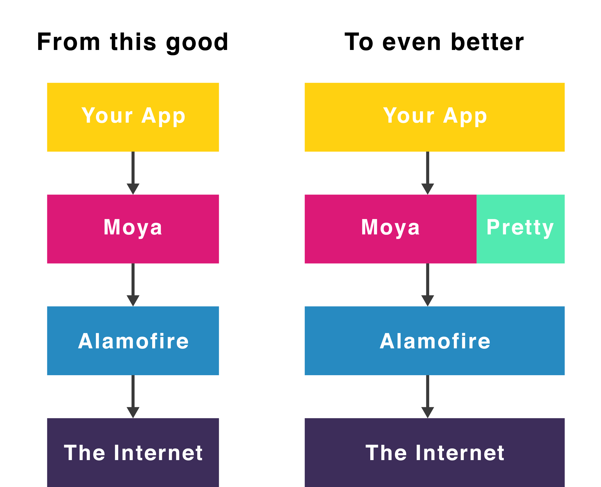

<p align="center">

</p>

# Moya-Pretty

[](https://travis-ci.org/arthurgau0419@gmail.com/Moya-Pretty)
[](https://cocoapods.org/pods/Moya-Pretty)
[](https://cocoapods.org/pods/Moya-Pretty)
[](https://cocoapods.org/pods/Moya-Pretty)

*Moya-Pretty* provides many powerful extensions like *generic class-based target*, *plugins*, even *RESTful traits*. This allows you to declare Moya Target more pretty and without writing those extensions again by yourself. 
Inspired by [*Moya*](https://github.com/Moya/Moya) and [*Retrofit*](https://github.com/square/retrofit). 👍 👍 👍



## Usage
Simply, declare your target class:
```swift
struct PetService {  
class PostPetThenResponsePet: CodableTarget<Pet, Pet>, BaseTargetType {
var method = Method.post
var path = "pet/"    
}
class PostPetOnly: EncodableTarget<Pet>, BaseTargetType {
var method = Method.post
var path = "pet/"    
}
class GetPets: DecodableTarget<[Pet]>, BaseTargetType {
var method = Method.get
var path = "pet/"    
}
}
```

Then, execute it:
```swift
let provider = MoyaProvider<PetService.AddPet>() 
let pet = Pet(id: 1, name: "Obi")
let target = PetService.AddPet(body: pet)
provider.requestModel(target, completion: { (result) in
switch result {
case .success(let pet):
// Pet model here 🎉 🎉 🎉
print(pet.name)
case .failure(let error):
fail(error.localizedDescription)
}
)

```

## Documention

### Generic<> Target

> `Codable` - decode, encode Json.
>
> - CodableTarget<Body, Response>
> - EncodableTarget<Body>
> - DecodableTarget<Response>

> `ObjectMapper` - json, xml, dictionary mapping.
> - MappableTarget<Body, Response>
> - MappableBodyTarget<Body>
> - MappableResponseTarget<Response>
> - XMLTargetType

### Pligins
> 
>
> - AcceptHeaderPlugin
> - FlexibleAccessTokenPlugin
> - InternationalizationPlugin

### RESTful
> 
>
> - FilterableTarget
> - FormPostableTarget

### RxSwift
Installation:
```ruby
pod 'Moya-Pretty/RxSwift'
```
Execute:
```swift
let provider = MoyaProvider<PetService.AddPet>() 
let pet = Pet(id: 1, name: "Obi")
let target = PetService.AddPet(body: pet)
provider.rx.requestModel(target).subscribe { event in
  switch event {
    case let .success(pet):
      // Pet model here 🎉 🎉 🎉
      print(pet.name)
    case let .error(error):
      print(error)
  }
}
```

### PromiseKit
Installation:
```ruby
pod 'Moya-Pretty/PromiseKit'
```
Execute:
```swift
let provider = MoyaProvider<PetService.AddPet>() 
let pet = Pet(id: 1, name: "Obi")
let target = PetService.AddPet(body: pet)
firstly {
  provider.requestModel(target)
}.done { (pet) in
  // Pet model here 🎉 🎉 🎉
  print(pet.name)
}.catch{ (error) in
  print(error)
}
```


## Example

`pod try Moya-Pretty`

To run the example project, clone the repo, and run `pod install` from the Example directory first.

## Requirements

## Installation

Moya-Pretty is available through [CocoaPods](https://cocoapods.org). To install
it, simply add the following line to your Podfile:

```ruby
pod 'Moya-Pretty'

pod 'Moya-Pretty/ObjectMapper'

pod 'Moya-Pretty/RxSwift'

pod 'Moya-Pretty/PromiseKit'

pod 'Moya-Pretty/RESTful'

pod 'Moya-Pretty/Plugins'

```

## Author

arthurgau0419@gmail.com

## License

Moya-Pretty is available under the MIT license. See the LICENSE file for more info.
